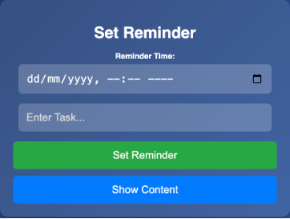
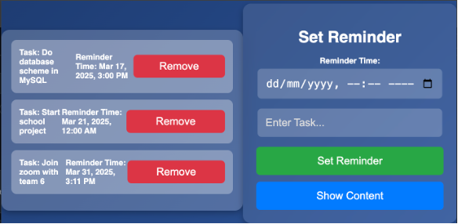
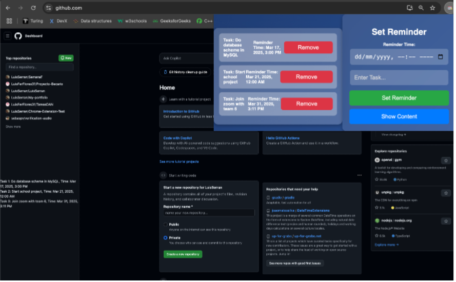

# Chrome-Extension-Test

This project is a personal endeavor to build a extension that creates reminders, all while I'm diving into the world of Chrome development. It's a "learning by doing" kind of thing, so expect more projects along the way!

## What's Inside

* **Reminder Functionality:** The core of the extension is to allow users to set simple reminders.
* **Package Exploration:** I'm experimenting with different ways to structure and package the extension.
* **Chrome Extension Basics:** This is also a learning experience in understanding the fundamentals of Chrome extension development.

## Features

* Set Reminders: Users can enter a task with a specific reminder time and receive an alert when the time arrives.
* Persistent Storage: Tasks and reminders are stored using chrome.storage.sync so that they're accessible across different browsing sessions.
* Dynamic UI: A simple popup interface is built and displays the current reminders, allowing users to manage them.
* GitHub Integration: When on a GitHub page, the extension can inject the list of reminders into the sidebar for quick reference.

  

## Tech Stack

* JavaScript
* HTML
* CSS
  

## Status

Work in progress. Expect updates and improvements as I learn more.

